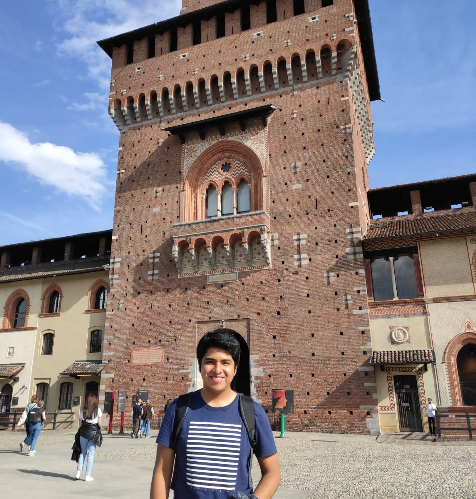

# Grupo 04 - Reconocimiento de Patrones 2024

Bienvenidos al repositorio del Grupo 04 para el proyecto de Reconocimiento de Patrones. Aquí encontrarán todos los recursos y trabajos realizados durante el curso.

## Presentación del Equipo
***Javier Urbina Alarcón*** (javier.urbina@upch.pe), estudiante de noveno ciclo de ingeniería biomedica de la Universidad Peruana Cayetano Heredia y la Pontificia Universidad Católica del Perú. Tengo interés por las áreas de Señales e Imágenes biomédicas y Biomecánica con énfasis en el análisis de enfermedades neurodegenerativas.

    

#Diego Segur Contreras:
Estudiante de ingeniería Biomédica, del 9no ciclo.

## Proyecto de Curso
### Descripción del Proyecto
(Descripción detallada del proyecto)

### Problemática
(Explica la problemática que aborda tu proyecto)

### Objetivos
(Enumera los objetivos del proyecto)

### Operacionalización de la variable (target)
(Explica cómo planeas medir o abordar la variable de interés en tu proyecto)
