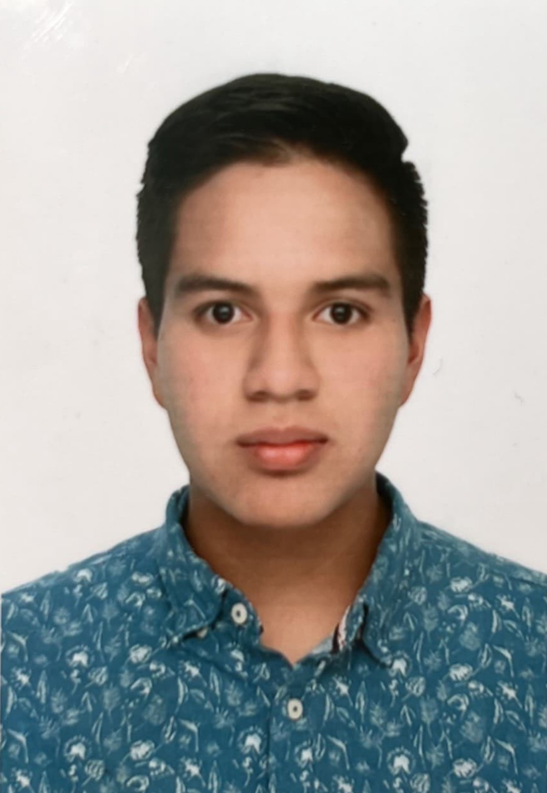

# Grupo 04 - Reconocimiento de Patrones 2024

Bienvenidos al repositorio del Grupo 04 para el proyecto de Reconocimiento de Patrones. Aquí encontrarán todos los recursos y trabajos realizados durante el curso. En este curso vamos a aprender sobre las técnicas de procesamiento de datos y entender como aplicar modelos según el tipo de datos. Al final del curso el objetivo es publicar un artículo o lograr un registro de software.

## Presentación del Equipo
***Javier Urbina Alarcón*** (javier.urbina@upch.pe), estudiante de noveno ciclo de ingeniería biomedica de la Universidad Peruana Cayetano Heredia y la Pontificia Universidad Católica del Perú. Tengo interés por las áreas de Señales e Imágenes biomédicas y Biomecánica con énfasis en el análisis de enfermedades neurodegenerativas.

    

***Diego Segur Contreras  (diego.segura.c@upch.pe):***
Estudiante de ingeniería Biomédica de noveno ciclo en la Universidad Peruana Cayetano Heredia y la Pontificia Universidad Católica del Perú. Tengo interés por las áreas de Ingeniería Clínca y Señales e Imágenes biomédicas, con enfasis en Elastografía de Surface acoustic waves.

    

***Claudia Camacho Grimaldi (claudia.camacho@upch.pe)***
Estudiante de Ingeniería Biomédica de Noveno noveno ciclo de ingeniería biomedica de la Universidad Peruana Cayetano Heredia y la Pontificia Universidad Católica del Perú. Tengo inclinación por Ingeniería Clínica y Señales e Imágenes.

    

## Proyecto de Curso

### Descripción del Proyecto
Este proyecto propone la creación de un sistema avanzado para la detección precisa de los niveles de Alzheimer, empleando la medida del Volumen Cerebral Total Normalizado (nWBV). Mediante la combinación de técnicas avanzadas de procesamiento de imágenes médicas y modelos de aprendizaje automático, el sistema analizará imágenes de resonancia magnética (RM) del cerebro para clasificar a los pacientes en distintas etapas de Alzheimer. La meta es perfeccionar la capacidad de diagnóstico precoz de la enfermedad, ofreciendo así una herramienta valiosa para la intervención temprana y la gestión personalizada del tratamiento.

### Problemática
La detección temprana de la enfermedad de Alzheimer (AD) a través de imágenes de resonancia magnética (RM) del cerebro es un reto significativo y crucial para mejorar la gestión y el tratamiento de esta enfermedad neurodegenerativa. El uso de técnicas avanzadas de aprendizaje automático, aprendizaje profundo y los modelos de redes neuronales convolucionales (CNNs), ha demostrado ser prometedor en la clasificación y detección precisa de la enfermedad. Estudios recientes han implementado modelos como ResNet50 para la extracción automática de características a partir de imágenes de RM, logrando precisiones notables en la clasificación de la enfermedad del Alzheimer, con rangos de preicision que oscilan entre el 85.7%, y el 99% en conjuntos de datos como el MRI ADNI [1]. Además, se ha propuesto un modelo ligero de DL que alcanza una precisión de hasta 99.22% en la clasificación binaria y el 95.93% en tareas de clasificación múltiple, superando a modelos previos y demostrando la eficiencia de estos enfoques en la detección de la enfermedad [2].

La capacidad de estos modelos para ser entrenados y validados en múltiples fuentes de datos independientes, como los proporcionados por la Iniciativa de Neuroimagen de la Enfermedad del Alzheimer (ADNI) y el OASIS, subraya su potencial generalizabilidad y aplicabilidad en diversos contextos clínicos [3]. El avance en la automatizaciòn de la extracciòn de caracterìsticas y la clasificaciòn mediante el uso de DL no solo promete mejorar la precisiòn en la detecciòn temprana del Alzheimer, sino tambièn facilita un seguimiento màs eficiente de la progresiòn de la enfermedad, lo cual es esencial para el desarrollo de estrategias de manejo y tratamiento efectivo. 
 
### Objetivos
* Desarrollar un sistema de inteligencia artificial capaz de detectar niveles de Alzheimer utilizando la Normalized Whole-brain Volume (nWBV).
* Mejorar el diagnóstico temprano de la enfermedad de Alzheimer mediante el uso de aprendizaje automático.
* Adaptar el sistema de clasificación para su aplicación en entornos de atención médica con recursos limitados, como países en vías de desarrollo.
  
### Metodología (tentativo):

* Recopilación de datos: Obtener conjuntos de datos de imágenes cerebrales que incluyan mediciones de nWBV y diagnósticos de Alzheimer → Base de datos OASIS 2.
* Preprocesamiento de datos: La limpieza de los datos, eliminando datos incorrectos, incompletos o redundantes. Luego, se procedera a normalizar los datos de imágenes cerebrales para su análisis, como normalización. Posteriormente, se codifican los datos, representandolo en un formato estandarizado. Finalmente, agrupando datos símilares en categorías.
* Desarrollo del modelo: Utilizar técnicas de aprendizaje automático, como redes neuronales convolucionales (CNN).
* Validación del modelo: Evaluar el rendimiento del modelo usando métricas de evaluación adecuadas.
* Optimización del modelo: Ajustar los hiperparámetros del modelo y realizar mejoras en el algoritmo para mejorar su precisión y generalización.

### Bibliografía
[1] AlSaeed, D.; Omar, S.F. Brain MRI Analysis for Alzheimer’s Disease Diagnosis Using CNN-Based Feature Extraction and Machine Learning. Sensors 2022, 22, 2911. https://doi.org/10.3390/s22082911
[2] El-Latif, A.A.A.; Chelloug, S.A.; Alabdulhafith, M.; Hammad, M. Accurate Detection of Alzheimer’s Disease Using Lightweight Deep Learning Model on MRI Data. Diagnostics 2023, 13, 1216. https://doi.org/10.3390/diagnostics13071216
[3] Diogo, V.S., Ferreira, H.A., Prata, D. et al. Early diagnosis of Alzheimer’s disease using machine learning: a multi-diagnostic, generalizable approach. Alz Res Therapy 14, 107 (2022). https://doi.org/10.1186/s13195-022-01047-y 
